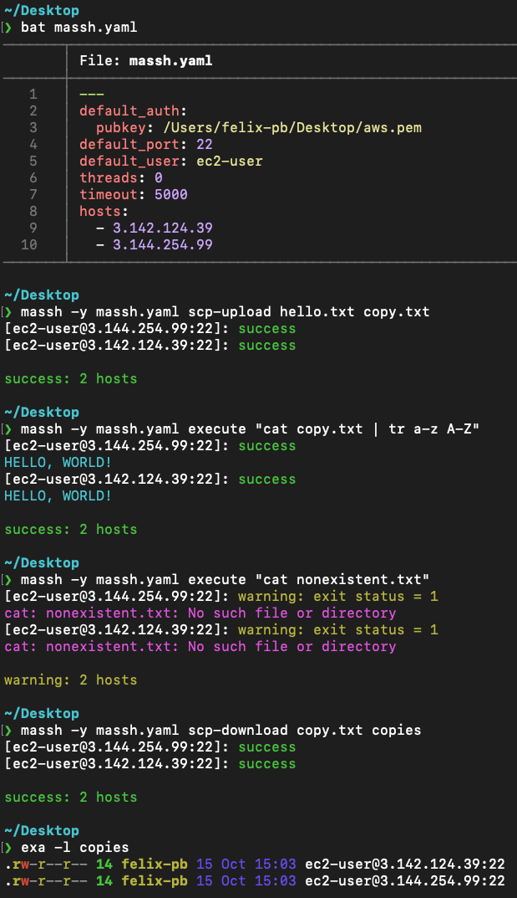

# massh

1 library and 2 binary crates to run SSH/SCP commands on a "mass" of hosts in parallel.

The binary crates are CLI and GUI "frontends" for the library "backend".

## Installation

Minimum supported rust version (MSRV): 1.52.0

```
cargo install massh
```

## massh library crate

Documentation: https://docs.rs/massh

## massh binary crate (CLI)

A Rust version of the parallel SSH program [`pssh(1)`](https://linux.die.net/man/1/pssh)

#### Usage:



## masshd binary crate (GUI)

A web application that runs on http://localhost:2222

#### Warning: WIP (work in progress)

Right now, masshd only serves placeholder static files but aims to support all the features of the CLI and more.
